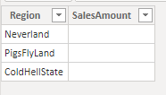
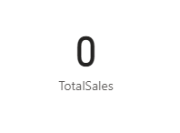

<!-- wp:paragraph -->

This one is easy once you know how to do it. It is also buried in <a href="https://docs.microsoft.com/en-us/dax/coalesce-function-dax#example-2">the documentation.</a> <a href="https://twitter.com/Kjonge/status/1256317833299943424">Kasper de Jonge mentioned it to me on Twitter</a> and I thought it would not hurt to just write it down quickly (also to make it easier for myself to find it in the future):

<!-- /wp:paragraph -->

<!-- wp:paragraph -->

Default behavior of Power BI is to show <strong>(Blank)</strong> when there is nothing, even when summing a numerical column that happens to be all empty. But what if you want to show <strong>0</strong> instead? Well, with <a href="https://docs.microsoft.com/en-us/dax/coalesce-function-dax">COALESCE </a>you can.

<!-- /wp:paragraph -->

<!-- wp:paragraph -->

In this simple example I have a table showing sales per region for a company that is not doing so good - they are not selling anything. 

<!-- /wp:paragraph -->

<!-- wp:image {"id":7684,"sizeSlug":"large"} -->
<figure class="wp-block-image size-large"><figcaption>Sales are <em>null</em>, maybe it's the Regions?</figcaption></figure>
<!-- /wp:image -->

<!-- wp:paragraph -->

Assuming SalesAmount is a numerical column, if you make a visual with this you get:

<!-- /wp:paragraph -->

<!-- wp:image {"id":7685,"sizeSlug":"large"} -->
<figure class="wp-block-image size-large"><figcaption>Technically correct return value</figcaption></figure>
<!-- /wp:image -->

<!-- wp:paragraph -->

Business users might just want to see <strong>0</strong> in this case, not the (more correct) <strong>(Blank)</strong>. To make this happen, add a simple measure:

<!-- /wp:paragraph -->

<!-- wp:preformatted -->
<pre class="wp-block-preformatted">TotalSales = COALESCE(SUM('Sales'[SalesAmount]),0)</pre>
<!-- /wp:preformatted -->

<!-- wp:paragraph -->

Creating a visual with that measure shows:

<!-- /wp:paragraph -->

<!-- wp:image {"id":7686,"sizeSlug":"large"} -->
<figure class="wp-block-image size-large"><figcaption>What your business user wants to see</figcaption></figure>
<!-- /wp:image -->

<!-- wp:paragraph -->

The way this works is that the COALESCE function will just return the first thing it finds reading from left to write in the parameter list <em>that is not null/blank</em>. That happens to be 0. If for whatever reason you wanted to show  <strong>-1</strong> when there are no sales, you can do that as well, just change the 0 to -1.

<!-- /wp:paragraph -->

<!-- wp:paragraph -->

Enjoy and don't forget to feel good about making your business users happy :)

<!-- /wp:paragraph -->