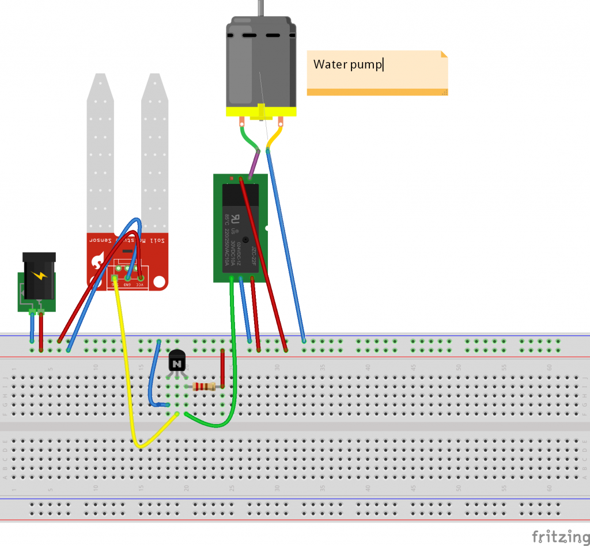
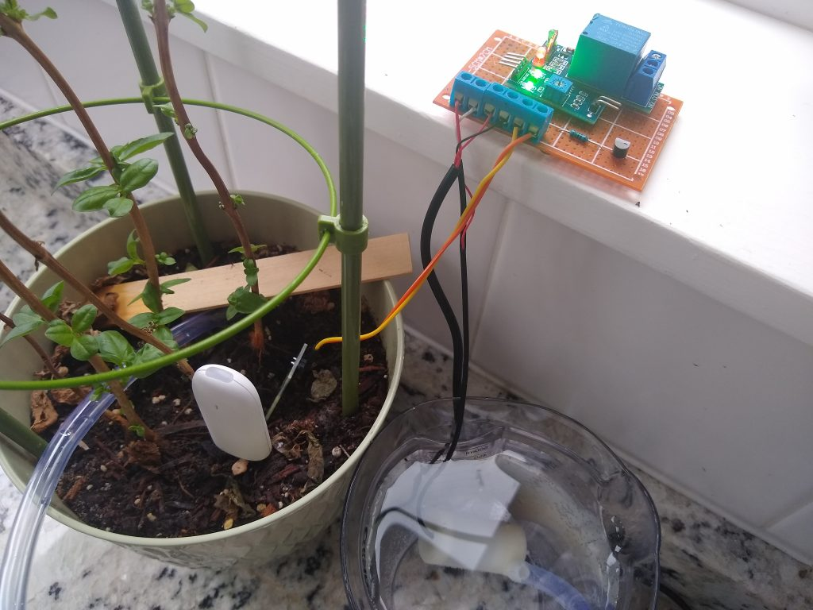

<!-- wp:paragraph -->

Ok, trying something new here - as you might know, I have been having fun with home automation for a while now. <a href="http://home-assistant.io">Home Assistant</a> is my platform of choice. I will start writing down the more interesting things I did to make my house "smarter" and publish them on this blog. This is the first of many (?) - we will see how it goes.

<!-- /wp:paragraph -->

<!-- wp:heading -->
<h2>The problem</h2>
<!-- /wp:heading -->

<!-- wp:paragraph -->

One thing we never seem to get right is when to water plants. We either overfeed them or forget them. In either case, they die quickly.

<!-- /wp:paragraph -->

<!-- wp:paragraph -->

As part of my many home automation endeavors I wanted to build an automatic plant watering system.

<!-- /wp:paragraph -->

<!-- wp:paragraph -->

The basic idea was: a water pump in a glass of water, a moisture sensor and whenever the soil the moisture sensor is measuring is dry, the water pump provides water until the soil is wet.

<!-- /wp:paragraph -->

<!-- wp:paragraph -->

I found this kit of Aliexpress:&nbsp; <a href="https://www.aliexpress.com/item/4001096063867.html?spm=a2g0s.9042311.0.0.66e74c4dDfCE0X">https://www.aliexpress.com/item/4001096063867.html?spm=a2g0s.9042311.0.0.66e74c4dDfCE0X</a>, which has almost everything you need. Almost.

<!-- /wp:paragraph -->

<!-- wp:paragraph -->

I say almost, because when you assemble this kit <em>it does the opposite from what you need</em>. Basically, when the sensor reports the soil is wet, the motor turns on and when the soil is dry, the motor turns off. <em>Update: after posting this I figured out you could also solve this issue by connecting to the NC instead of the NO of the relay.</em>

<!-- /wp:paragraph -->

<!-- wp:paragraph -->

Also, it is not very clear how you need to connect this kit to make it work.

<!-- /wp:paragraph -->

<!-- wp:paragraph -->

See the original kit in action below:

<!-- /wp:paragraph -->

<!-- wp:video {"id":7720} -->
<figure class="wp-block-video"><video controls src="../wp-content/uploads/2020/11/VID_20201110_121053348.mp4"></video></figure>
<!-- /wp:video -->

<!-- wp:heading -->
<h2>Putting it together</h2>
<!-- /wp:heading -->

<!-- wp:paragraph -->

Here is what I did:

<!-- /wp:paragraph -->

<!-- wp:list -->
<ul><li>First, I used the USB cable that came with the kit to provide power (you can use another way of getting 5V of power)</li></ul>
<!-- /wp:list -->

<!-- wp:list -->
<ul><li>Then, I added a 2N700 transistor to build a simple inverter (see <a href="http://www.learningaboutelectronics.com/Articles/Transistor-inverter-circuit.php">http://www.learningaboutelectronics.com/Articles/Transistor-inverter-circuit.php</a>). It takes the input from the moisture sensor and provides it to the relay, effectively reversing the effect: when the soil is dry, turn on the pump, when the soil is wet, turn off the pump. You can use the small potentiometer on the moisture sensor breakout board to adjust sensitivity to moisture. You need a 1M Ohm resistor as well.</li></ul>
<!-- /wp:list -->

<!-- wp:paragraph -->

This is the circuit on a breadboard:

<!-- /wp:paragraph -->

<!-- wp:image {"id":7719,"sizeSlug":"large"} -->
<figure class="wp-block-image size-large"></figure>
<!-- /wp:image -->

<!-- wp:paragraph -->

These are the connections:

<!-- /wp:paragraph -->

<!-- wp:list -->
<ul><li>Moisture sensor: connect to two pin side of breakout board. Does not matter which way.</li><li>Moisture sensor breakout board:<ul><li>VCC --&gt; +5V</li><li>GND --&gt; GND</li><li>D0 (digital output) --&gt; input of 2N700 (middle)</li></ul></li><li>2N700 inverter:<ul><li>Left --&gt; GND</li><li>Middle --&gt; D0 (digital output) of moisture sensor breakout board</li><li>Right --&gt; 1M resistor --&gt; +5V and to Input of relay</li></ul></li><li>Relay:<ul><li>VCC --&gt; +5V</li><li>GND --&gt; GND</li><li>IN --&gt; Right output of 2N700</li><li>COM --&gt; +5V</li><li>NO --&gt; Red wire of water pump</li></ul></li><li>Water pump:<ul><li>Black --&gt; GND</li><li>Red --&gt; NO of Relay.</li></ul></li></ul>
<!-- /wp:list -->

<!-- wp:paragraph -->

<!-- /wp:paragraph -->

<!-- wp:paragraph -->

This is the final setup (before making it look pretty with a case and longer wires):

<!-- /wp:paragraph -->

<!-- wp:image {"id":7722,"sizeSlug":"large"} -->
<figure class="wp-block-image size-large"></figure>
<!-- /wp:image -->