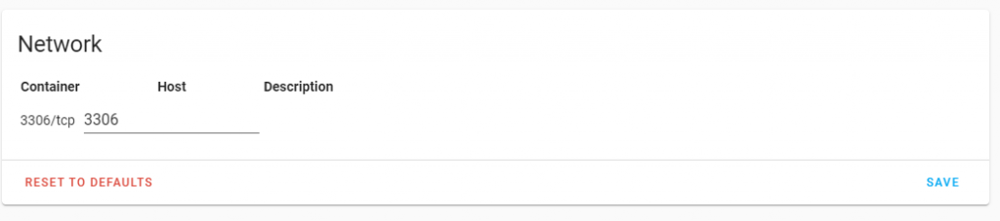
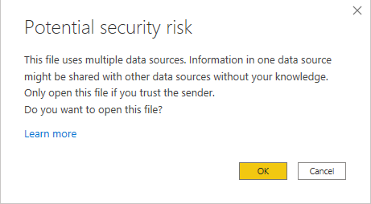
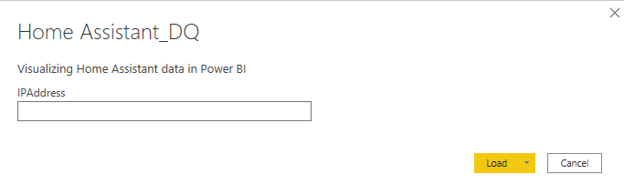
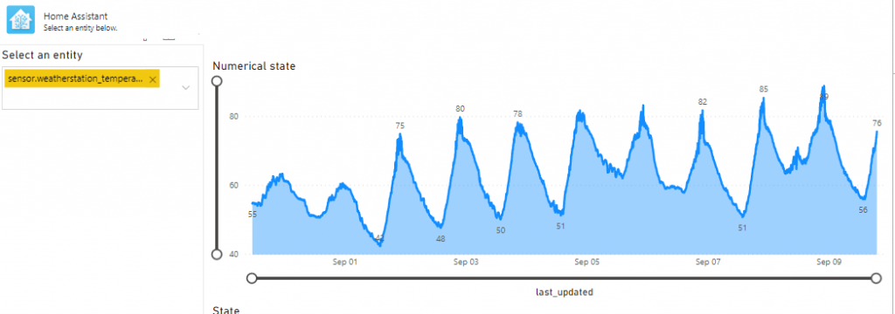
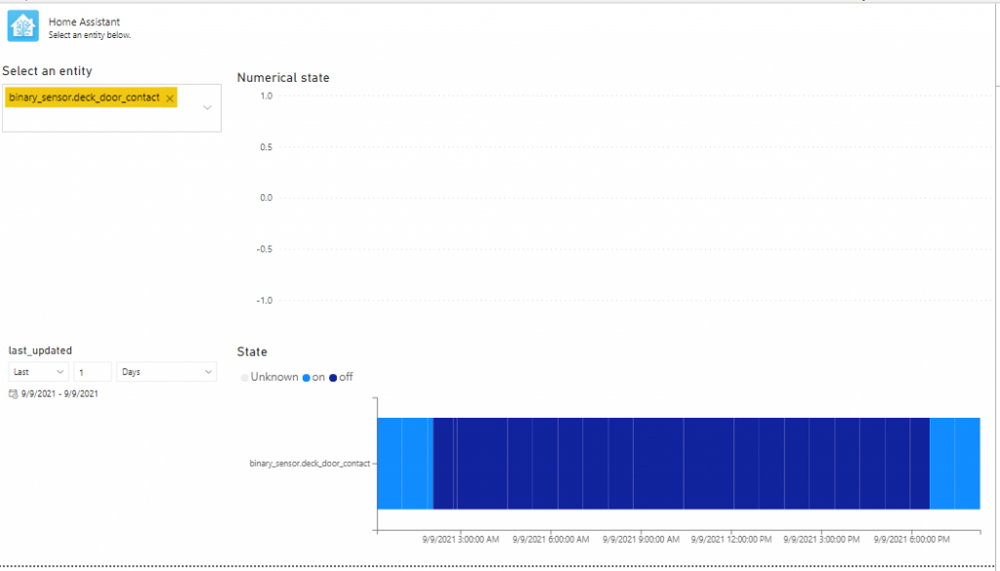

<!-- wp:paragraph -->

Ahhh, Power BI and Home Assistant. Two of my favorite tools. So, why not try to bring them together? I like the Home Assistant data visualizations, but they are limited - that's where Power BI can really help. But how to bring data from Home Assistant to Power BI? Well, I figured it out, so here's is how.

<!-- /wp:paragraph -->

<!-- wp:paragraph -->

I chose to use DirectQuery mode in Power BI to avoid having to import a sizable dataset in to Power BI and suffer from delays. I want Power BI to show real-time information from Home Assistant, so DirectQuery is the way forward.

<!-- /wp:paragraph -->

<!-- wp:paragraph -->

The problem is that the way Home Assistant stores that is not entirely great for Power BI. So, you would have to introduce a layer between Home Assistant and Power BI to present that in a slightly different structure to Power BI compared to how Home Assistant stores it. Alternatively, you could use Power Query to try to transform the data there, but that would not work. A SQL view is the solution here. That leads to the first ingredient: the database. Once you have the database set up you can add views and have Power BI connect to the views.

<!-- /wp:paragraph -->

<!-- wp:paragraph -->

<!-- /wp:paragraph -->

<!-- wp:paragraph -->

<strong>Step 1: use MariaDB as your Home Assistant Database</strong>

<!-- /wp:paragraph -->

<!-- wp:paragraph -->

By default, Home Assistant leverages a <a href="https://www.sqlite.org/">SQLite </a>database. I was unable to connect this to Power BI reliably. Also, I was unable to add a view to the database that provides the data in the structure that Power BI handle. Hence, my advice is: switch to another database. I picked MariaDB. So, first off: run MariaDB as your Home Assistant database. I<a href="https://github.com/home-assistant/addons/blob/master/mariadb/DOCS.md">nstall the MariaDB add-on following these instructions</a>.

<!-- /wp:paragraph -->

<!-- wp:paragraph -->

On the configuration page of the MariaDB addon enable port 3306 as the host port and hit save. Then restart the addon.

<!-- /wp:paragraph -->

<!-- wp:image {"id":7822,"sizeSlug":"large","linkDestination":"none"} -->
<figure class="wp-block-image size-large"></figure>
<!-- /wp:image -->

<!-- wp:paragraph -->

Restart your Home Assistant environment and make sure you don't get any recorder errors.

<!-- /wp:paragraph -->

<!-- wp:paragraph -->

<!-- /wp:paragraph -->

<!-- wp:paragraph -->

<strong>Step 2: install PhpMyAdmin addon</strong>

<!-- /wp:paragraph -->

<!-- wp:paragraph -->

For us to create the view, we need to access the database. <a href="https://github.com/hassio-addons/addon-phpmyadmin">I chose to install the PhpMyAdmin addon using these instructions.</a>

<!-- /wp:paragraph -->

<!-- wp:paragraph -->

<!-- /wp:paragraph -->

<!-- wp:paragraph -->

<strong>Step 3: create views</strong>

<!-- /wp:paragraph -->

<!-- wp:paragraph -->

Run the below query on your <code>homeassistant</code> database using PhpMyAdmin. You can also <a href="https://github.com/jeroenterheerdt/dutchdatadude/blob/master/Visualizing-Home-Assistant-data-in-Power-BI/query.sql">download the query here</a>.

<!-- /wp:paragraph -->

<!-- wp:code -->
<pre class="wp-block-code"><code>DROP FUNCTION IF EXISTS `IsNumeric`;
DROP VIEW IF EXISTS `states_powerbi`;
DROP VIEW IF EXISTS `entities_powerbi`;

CREATE FUNCTION IsNumeric (sIn varchar(1024)) RETURNS tinyint
RETURN sIn REGEXP '^(-|\\+){0,1}(&#91;0-9]+\\.&#91;0-9]*|&#91;0-9]*\\.&#91;0-9]+|&#91;0-9]+)$';

CREATE VIEW states_powerbi as
select
	a.state_id
    ,a.entity_id
    ,a.state
    ,a.attributes
    ,JSON_EXTRACT(a.attributes, '$.unit_of_measurement') as unit_of_measurement
    ,a.last_changed
    ,a.last_updated
    ,a.created
    ,CASE WHEN a.isnumeric = 1 THEN a.state_numeric else NULL END as state_numeric
from (
    select
        state_id,
        entity_id,
        state,
        attributes,
        last_changed,
        last_updated,
        created,
        IsNumeric(state) as isnumeric,
        CAST(state as float) as state_numeric
    from states
) a;

CREATE VIEW entities_powerbi as
SELECT distinct entity_id, domain FROM states;</code></pre>
<!-- /wp:code -->

<!-- wp:paragraph -->

<!-- /wp:paragraph -->

<!-- wp:paragraph -->

<strong>Step 4: connect Power BI to your Home Assistant installation</strong>

<!-- /wp:paragraph -->

<!-- wp:paragraph -->

First of all, you will need to <a href="https://mariadb.com/resources/blog/getting-started-with-the-mariadb-direct-query-adapter-for-microsoft-power-bi/">make sure you have the MariaDB ODBC driver installed</a> for Power BI to be able to load data from the MariaDB database. Be sure to select the ODBC driver and the appropriate version (64 or 32 bits). Here are direct links, although the version of the driver could be outdated: <a href="https://dlm.mariadb.com/1671860/connectors/odbc/connector-odbc-3.1.13/mariadb-connector-odbc-3.1.13-win64.msi">64-bit</a> or <a href="https://dlm.mariadb.com/1671845/connectors/odbc/connector-odbc-3.1.13/mariadb-connector-odbc-3.1.13-win32.msi">32-bit</a>. After installing the driver, <a href="https://github.com/jeroenterheerdt/dutchdatadude/blob/master/Visualizing-Home-Assistant-data-in-Power-BI/Home%20Assistant_DQ.pbit">open this Power BI file</a> in Power BI Desktop.

<!-- /wp:paragraph -->

<!-- wp:paragraph -->

Select 'OK' in the security risk pop-up:

<!-- /wp:paragraph -->

<!-- wp:image {"id":7833,"sizeSlug":"full","linkDestination":"none"} -->
<figure class="wp-block-image size-full"></figure>
<!-- /wp:image -->

<!-- wp:paragraph -->

You should get a request to enter the local IP of your Home Assistant installation. If not, open the Power Query Editor by choosing Transform Data and change the IPAddress parameter value there.

<!-- /wp:paragraph -->

<!-- wp:image {"id":7838,"sizeSlug":"full","linkDestination":"none"} -->
<figure class="wp-block-image size-full"></figure>
<!-- /wp:image -->

<!-- wp:paragraph -->

After entering the IP Address you should be prompted for credentials to connect to the MariaDB. The default username is homeassistant and the password is whatever you set up in step 1.

<!-- /wp:paragraph -->

<!-- wp:image {"id":7839,"sizeSlug":"full","linkDestination":"none"} -->
<figure class="wp-block-image size-full"></figure>
<!-- /wp:image -->

<!-- wp:paragraph -->

After this, select Close &amp; Apply to apply these changes.

<!-- /wp:paragraph -->

<!-- wp:paragraph -->

<!-- /wp:paragraph -->

<!-- wp:paragraph -->

<strong>Step 5: Enjoy</strong>

<!-- /wp:paragraph -->

<!-- wp:paragraph -->

The report provided is just an example report and allows you to search entities and show their values. The top right is an area chart which is great for numerical values such as temperatures. The bottom right is a custom visual built by<a href="https://www.linkedin.com/in/jpposthuma/"> Jan Pieter Posthuma</a> which is great for entities that are not numerical (such as open/closed or home/away) which you <a href="https://appsource.microsoft.com/en-us/product/power-bi-visuals/janpieterposthuma1781555020.eventviewer">can find here</a><strong>.</strong> For more info on this visual please <a href="https://azurebi-docs.jppp.org/powerbi-visuals/event-viewer.html">read the documentation available here</a> or <a href="https://github.com/liprec/powerbi-eventViewer/issues">look at the issues reported on GitHub</a>.

<!-- /wp:paragraph -->

<!-- wp:image {"id":7818,"sizeSlug":"large","linkDestination":"none"} -->
<figure class="wp-block-image size-large"><figcaption>Numerical sensor</figcaption></figure>
<!-- /wp:image -->

<!-- wp:image {"id":7819,"width":840,"height":479,"sizeSlug":"large","linkDestination":"none"} -->
<figure class="wp-block-image size-large is-resized"><figcaption>Non numerical sensor</figcaption></figure>
<!-- /wp:image -->

<!-- wp:paragraph -->

I hope you enjoy exploring your Home Assistant data using Power BI! Let me know what you think and please share what you produce! I am sure there is way more to do and cool things to build, so curious to hear from you!

<!-- /wp:paragraph -->