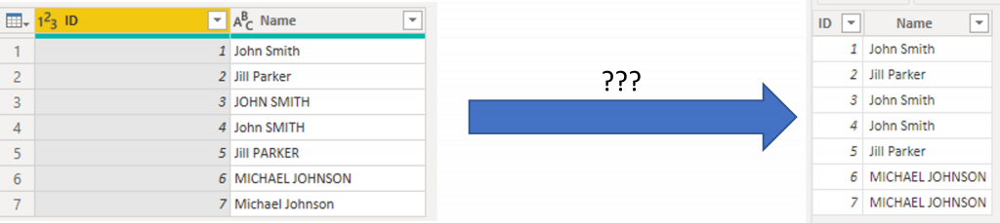
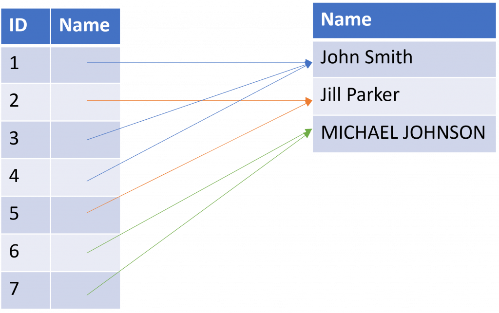

<!-- wp:paragraph -->

Some of you might have seen this before - you load some data into Power BI and suddenly the capitalization (uppercase / lowercase) of your text changes on you. Let me explain what is happening here.

<!-- /wp:paragraph -->

<!-- wp:image {"id":7855,"sizeSlug":"large","linkDestination":"none"} -->
<figure class="wp-block-image size-large"><figcaption>On the left, Data Transformation window where the data is as I expected. On the right: Power BI after loading the data. Capitalization is not the same. Why does this happen?</figcaption></figure>
<!-- /wp:image -->

<!-- wp:heading -->
<h2>Why this happens</h2>
<!-- /wp:heading -->

<!-- wp:paragraph -->

The reason for this is simple: The Analysis Services engine that underpins Power BI is case-insensitive (no, there is no way for you to change that). Also, the engine uses compression techniques to handle the massive amounts of data it can handle. Those two things combined result in this behavior. Here's the details on what the engine does:

<!-- /wp:paragraph -->

<!-- wp:list {"ordered":true} -->
<ol><li>When loading the data, the engine starts evaluating the data top to bottom. The first Name it sees is for row 1, ID 1: 'John Smith'. It stores that value in a list for tracking the unique values of Name. Then it stores the ID and the reference to 'John Smith' in the list of Names and continues to row 2.</li><li>For row 2, It sees another Name: 'Jill Parker'. It compares it to what it already has stored in the list of Names ('John Smith'), ignoring case/capitalization and sees that it's not the same.  It happily stores the value in the separate list, stores the ID and the reference and continues to row 3.</li><li>For row 3, it compares 'JOHN SMITH' to what it already has stored ('John Smith' and 'Jill Parker') and concludes that 'JOHN SMITH' is the same as 'John Smith' (remember, it is case insensitive, so then these are indeed the same). As they are the same, it does not store 'JOHN SMITH' separately, but instead stores '3' as ID and then refers the Name to the 'John Smith' it already stored before. For row 4, exactly the same: 'John SMITH' is the same as 'John Smith' ignoring capitalization. For row 5, 'Jill PARKER' is the same as 'Jill Parker' ignoring capitalization, so again the same.</li><li>Row 6 provides a different name 'MICHAEL JOHNSON' so the engine stores it.</li><li>Row 7 again has the same name, so that is not stored, just referred.</li></ol>
<!-- /wp:list -->

<!-- wp:paragraph -->

At the end of processing the engine has the following captured. I am simplifying things here, as this is not exactly how it happens, but the idea is similar:

<!-- /wp:paragraph -->

<!-- wp:image {"id":7856,"sizeSlug":"large","linkDestination":"none"} -->
<figure class="wp-block-image size-large"></figure>
<!-- /wp:image -->

<!-- wp:paragraph -->

So as a result, the rows shown after data is loaded are exactly as in the screenshot above. The reason capitalization is not consistent is simply because the engine came across those ways of printing the Names first.

<!-- /wp:paragraph -->